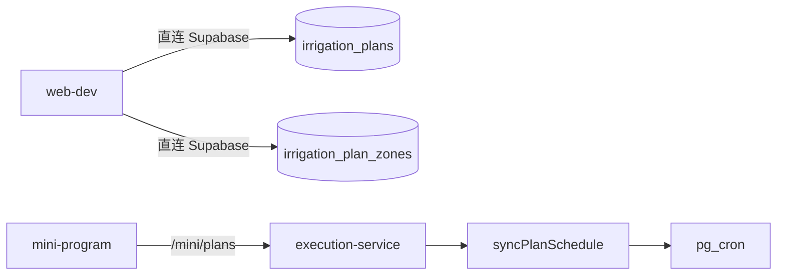
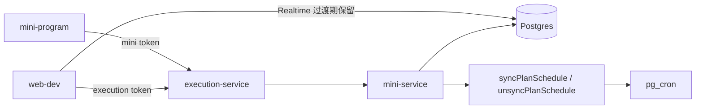

# Web 计划 API 统一改造计划

> 状态：实施中（Phase 1–2 代码已落地，待部署验收）  
> 目标：Web 端计划写操作不再直连 Supabase，统一通过 `execution-service` 完成计划 CRUD 与调度同步，彻底消除“计划已改但 cron 未同步”的问题。

## 背景

本次问题已经确认根因：

- Web 当前直接写 `irrigation_plans` / `irrigation_plan_zones`
- `pg_cron` 的同步逻辑只在 `execution-service` 的 `/mini/plans` 写路径后触发
- 因此 Web 改计划时间后，数据库里的 `start_at` 已更新，但 `plan_schedule_jobs.cron_expression` 仍可能停留在旧值

这不是单点 bug，而是**写路径分叉**导致的架构问题。

结论：

- 不再继续补“Web 直写 Supabase 后再手工 resync”的流程
- 直接按正式形态改造：**计划写入口统一到 `execution-service`**

## 目标

### 业务目标

- Web 创建、更新、删除、手动执行、暂停/停止计划时，调度同步自动完成
- Web 修改自动计划后，无需额外执行 `resync-auto-plan-jobs`
- Web 与小程序共享同一套计划写入语义

### 技术目标

- Web 不再直接写 `irrigation_plans`
- Web 不再直接写 `irrigation_plan_zones`
- create/update/delete 与 `syncPlanSchedule` / `unsyncPlanSchedule` 绑定为同一次后端成功语义
- 后续计划读路径也逐步统一到 `execution-service`

## 非目标

- 本轮不引入 Supabase Edge Function
- 本轮不改数据库表结构
- 本轮不重做 Web 全量业务 API，只聚焦“计划”相关链路
- 本轮不把设备、地块、策略写路径一并迁移

## 当前问题结构

当前两条写路径行为不一致：

| 入口 | 是否写库 | 是否同步 cron |
|------|----------|---------------|
| 小程序 `/mini/plans` | 是 | 是 |
| Web 直连 Supabase | 是 | 否 |

因此只要 Web 修改自动计划，就存在调度漂移风险。

## 目标架构

设计原则：

- **写路径统一**：Web 与小程序计划写入都走 `execution-service`
- **读路径分阶段**：第一阶段允许 Web 暂时继续从 Supabase 读取；第二阶段统一到 API
- **鉴权分层**：Web 不复用“再次提交邮箱密码”的桥接方案，而是使用 Supabase token exchange

## 总体方案

本次改造分三阶段执行：

1. **Phase 1：统一计划写入口**
2. **Phase 2：补齐 Web 到 execution-service 的稳妥鉴权**
3. **Phase 3：统一计划读入口**

其中：

- Phase 1 是必须完成的核心改造
- Phase 2 是上线前必须具备的稳妥方案，不采用“密码重复登录”
- Phase 3 可以在写路径稳定后继续推进

**阶段依赖（必须遵守）**：

- Phase 1 的**后端部分**（DELETE、sync/unsync 强制失败语义）可独立先发
- Phase 1 的 **Web 写迁移**必须在 **Phase 2 token exchange 上线之后**才能发，不可单独发“只改 Web、未做 exchange”的版本
- 实际落地顺序见下文「实施顺序」，以实施顺序为准，不以章节编号先后为准

## Phase 1：统一计划写入口

> **依赖说明**：本节 Web 改造依赖 Phase 2 的 `POST /web/auth/exchange` 已可用；鉴权未就绪前，仅合并后端改动，不发布 Web 计划写路径切换。

### 目标

将 Web 端以下操作全部迁移到 `execution-service`：

- 创建计划
- 更新计划
- 删除计划
- 手动启动计划
- 暂停计划
- 停止计划

### 后端改造

#### 1. 补齐删除能力

当前 `app.mjs` 已有：

- `GET /mini/plans`
- `GET /mini/plans/:id`
- `POST /mini/plans`
- `PATCH /mini/plans/:id`
- `POST /mini/plans/:id/start|pause|stop`

缺少：

- `DELETE /mini/plans/:id`

需要新增：

- `miniService.deletePlan(userId, planId)`
- `runService.unsyncPlanSchedule(planId)`
- `DELETE /mini/plans/:id`

删除语义要求：

- 校验计划归属
- **固定顺序**（与「sync 失败即失败」一致，避免库表已删但 cron 残留）：
  1. `unsyncPlanSchedule(planId)` — 失败则返回 5xx，**不继续删库**
  2. 删除 `irrigation_plan_zones`
  3. 删除 `irrigation_plans`
- 不允许留下孤儿 cron job

#### 2. 将调度同步提升为强制成功条件

这是本次改造最关键的一条。

当前 `runService.syncPlanSchedule()` 内部会记录错误日志，但默认吞掉错误。这个行为不适合作为正式写入口语义。

改造后要求：

- `POST /mini/plans`：
  - 创建计划成功后执行 `syncPlanSchedule`
  - 若 sync 失败，则接口返回 5xx
- `PATCH /mini/plans/:id`：
  - 更新计划成功后执行 `syncPlanSchedule`
  - 若 sync 失败，则接口返回 5xx
- `DELETE /mini/plans/:id`：
  - 删除时执行 `unsyncPlanSchedule`
  - 若 unsync 失败，则接口返回 5xx

不接受以下行为：

- 计划保存成功但 cron 未更新，接口仍返回 200/201
- 计划删除成功但 cron 仍残留，接口仍返回成功

建议实现方式：

- 将 `syncPlanSchedule` / `unsyncPlanSchedule` 从“吞错日志型”改为“向上抛错型”
- 路由层统一捕获并返回结构化错误

**sync 失败时的数据一致性（本方案固定，不再二选一）**：

- `create`：
  - insert 计划/分区后若 `syncPlanSchedule` 失败
  - 执行补偿删除刚创建的计划与分区
  - 接口返回 5xx
- `update`：
  - update 后若 `syncPlanSchedule` 失败
  - **不做字段回滚**
  - 接口返回 5xx + 明确错误码（如 `SCHEDULE_SYNC_FAILED`）
  - 前端提示「计划已保存到数据库，但调度同步失败，请重试保存」
  - 用户下一次重试保存时，后端以**数据库当前值**作为最新基准重新执行 sync，不基于前端旧草稿做补偿判断
- `delete`：
  - 先 `unsyncPlanSchedule`
  - unsync 失败则**不删库**
  - 接口返回 5xx

固定原因：

- `create` 的补偿删除成本低，能避免留下“已创建但无 cron”的新脏数据
- `update` 若做字段回滚，需要先保存旧快照，复杂度和失败面更大，本轮不做伪事务回滚
- `delete` 必须坚持“先 unsync、后删库”，否则容易留下孤儿 cron

不接受：接口返回 201/200，而 `plan_schedule_jobs` 仍为旧 cron 或缺失。

#### 3. 提供统一的计划写 helper

建议在 `app.mjs` 或 `run-service` 附近抽一个统一 helper：

- `syncPlanScheduleAfterMutation(planId)`
- `unsyncPlanScheduleAfterDeletion(planId)`

目的是避免：

- create/update/delete 各自重复拼装错误处理
- 后续新增计划状态变更入口时漏掉同步逻辑

### Web 改造

#### 1. 替换计划写接口

`web-dev/src/lib/planService.ts` 当前直写 Supabase 的以下函数需要迁移：

- `createPlanInSupabase`
- `updatePlanInSupabase`
- `deletePlanInSupabase`

调整为：

- `createPlanViaExecutionApi`
- `updatePlanViaExecutionApi`
- `deletePlanViaExecutionApi`

底层分别调用：

- `POST /mini/plans`
- `PATCH /mini/plans/:id`
- `DELETE /mini/plans/:id`

#### 2. 替换计划动作接口

Web 当前手动执行不应继续走裸内部路径或自定义路径，应统一对齐为：

- `POST /mini/plans/:id/start`
- `POST /mini/plans/:id/pause`
- `POST /mini/plans/:id/stop`

#### 3. 明确移除 Web 对计划表的写权限依赖

改造完成后，Web 不再直接依赖：

- `irrigation_plans` insert/update/delete
- `irrigation_plan_zones` insert/update/delete

即使短期读路径仍保留 Supabase，也不允许保留任何计划写库逻辑。

## Phase 2：Web 鉴权改造

### 目标

让 Web 可以稳定访问 `/mini/*`，但不引入“再次提交邮箱密码”的脆弱方案。

### 不采用的方案

不采用：

- Supabase 登录成功后，再用邮箱 + 密码调用 `/mini/auth/login`
- 在前端持久化密码
- 401 后要求用户重新输入密码才能继续计划操作

原因：

- Web 当前只有 Supabase session，不持久化用户明文密码
- 页面刷新后无法可靠恢复 execution 会话
- 安全性和用户体验都不好

### 推荐方案：Supabase token exchange

流程：

1. Web 用户正常用 Supabase 登录
2. Web 获取当前 Supabase access token
3. Web 调用 execution-service 新增接口，例如：
   - `POST /web/auth/exchange`
4. execution-service 服务端校验 Supabase token
5. 校验通过后，签发 execution token
6. Web 后续调用 `/mini/plans*` 时带 execution token

这样做的好处：

- 不需要前端再次持有用户密码
- 页面刷新后可以基于当前 Supabase session 再次 exchange
- execution-service 可以独立控制 token 生命周期和权限边界

### 实施要求

Web 侧新增：

- `executionAuth.ts`
- `ensureExecutionSession()`
- `executionFetch()`

要求：

- 自动附带 execution token
- token 失效时可基于当前 Supabase session 自动重新 exchange
- 不暴露 `EXECUTION_INTERNAL_TOKEN`

### Token exchange 实现要点

**接口与路由**

- 建议路径：`POST /web/auth/exchange`（由 Nginx 反代到 execution-service，对外一般为 `https://<api-host>/api/execution/web/auth/exchange`）
- 请求体：`{ "supabaseAccessToken": "<jwt>" }` 或由 `Authorization: Bearer <supabase_jwt>` 传递（二选一，实现时固定一种）

**路由注册位置（必须）**

- `exchange` 与 [`/mini/auth/login`](../../services/execution-service/src/app.mjs) **同级**：挂在「`/mini/*` 要求已有 session」的 `getSession` 校验**之前**
- 不得把 `POST /web/auth/exchange` 放进需要 execution token 的中间件之后，否则会出现「要先有 token 才能换 token」的死锁

**服务端校验（不可信任前端 user id）**

- 使用 Supabase 官方校验：`GET {SUPABASE_URL}/auth/v1/user` + `Authorization: Bearer <jwt>`，或 `supabase.auth.getUser(jwt)`（service role 环境）
- 仅在校验通过后，用返回的 `user.id` 签发 execution token

**Execution token 存储（本方案固定）**

- 直接复用现有 [`mini-auth-store`](../../services/shared/mini-auth-store.mjs) 与 `mini_sessions` 表
- 本轮**不新增** `web_sessions` 表
- 本轮**不新增** `source` 字段
- execution token 与 mini token 共用现有 session 读取/校验逻辑
- TTL 与 [`MINI_SESSION_TTL_HOURS`](../../services/execution-service/src/config.mjs) 对齐

固定原因：

- 避免为了 Web 计划改造再引入一轮 schema migration
- 避免 session 体系拆成两套，增加鉴权复杂度
- 与本文档“本轮不改数据库表结构”保持一致

**Web 调用约定**

- exchange 得到的 token 存 `sessionStorage`（如 `irrigation_execution_token`）
- 调用 `/mini/plans*` 时带 `Authorization: Bearer <execution_token>`（与小程序 token 使用**同一 header 约定**，不新增自定义 header 名）
- 收到 401 时：若 Supabase session 仍有效，自动重新 exchange 一次后重试原请求

**`/mini/*` 鉴权兼容要求**

- `execution-service` 现有 `/mini/*` 鉴权层需统一接受两类 token：
  - 小程序通过 `/mini/auth/login` 签发的 token
  - Web 通过 `/web/auth/exchange` 签发的 execution token
- 两类 token 底层都走同一套 session 读取与校验逻辑
- 本轮不再拆出单独的 Web session 校验中间层

## Phase 3：统一计划读入口

### 目标

消除“Web 读 Supabase、自身做映射；execution-service 也读同一张表、自己再做映射”的双模型风险。

### 一期允许的过渡态

短期允许：

- 写：走 execution-service
- 读：仍从 Supabase 拉计划列表与分区
- Realtime：继续用现有订阅

这个阶段的价值只是减少一次改造范围，降低上线复杂度。

### 最终形态

后续应改为：

- `GET /mini/plans`
- `GET /mini/plans/:id`

由 Web 统一从 `execution-service` 获取计划列表和详情。

原因：

- 避免字段映射双份维护
- 避免未来计划字段新增时 Web 与 mini-service 漂移
- 让 Web 和小程序使用同一份契约

## 契约与类型

建议同步补齐 `@irrigation/api` 中的计划接口契约：

- create request/response
- update request/response
- delete response
- start/pause/stop response
- list/detail response

目标：

- Web、小程序、服务端共享同一套计划 API 类型
- 避免 Web 再本地复制最小类型定义

## 测试要求

### 后端测试

至少新增以下测试：

1. `POST /mini/plans` 成功后调用 `syncPlanSchedule`
2. `PATCH /mini/plans/:id` 成功后调用 `syncPlanSchedule`
3. `DELETE /mini/plans/:id` 成功后调用 `unsyncPlanSchedule`
4. `syncPlanSchedule` 失败时，接口返回错误；`create` 场景下计划行已回滚或不存在残留 cron
5. `unsyncPlanSchedule` 失败时，接口返回错误且计划行未被删除

### Web 测试

至少覆盖：

1. createPlan 走 execution-service，不再直写 Supabase
2. updatePlan 走 execution-service
3. deletePlan 走 execution-service
4. token 失效后能重新 exchange
5. 保存失败时 UI 明确提示（含 `SCHEDULE_SYNC_FAILED`：`update` 后 sync 失败须展示「计划已保存到数据库，但调度同步失败，请重试保存」，不得仅提示「保存成功」）
6. `create` sync 失败时 UI 不得展示成功；列表/详情不出现无 cron 的孤儿 auto 计划

### 集成验收

至少人工或脚本验证：

1. Web 创建 auto 计划后，`plan_schedule_jobs` 新增对应记录
2. Web 修改 `start_at` 后，`cron_expression` 与 `next_run_at` 立即更新
3. Web 将计划改为 `manual` 或 `enabled=false` 后，cron 被取消
4. Web 删除计划后，cron 不存在
5. 小程序 create/update/delete/start/stop 不退化
6. **重试路径**：人为或测试环境制造 `update` 后 `SCHEDULE_SYNC_FAILED`，用户再次保存同一计划后，`plan_schedule_jobs` 与 `start_at` 对齐

## 实施顺序

建议按以下顺序落地（**Web 写迁移不得早于步骤 2**）：

1. **`execution-service`（可单独部署）**
   - 新增 `DELETE /mini/plans/:id`（固定顺序：unsync → 删 zones → 删 plan）
   - 暴露 `unsyncPlanSchedule`
   - 将 `sync/unsync` 改为向上抛错；create 失败时补偿回滚（见上文）
2. **`execution-service`（Web 上线前置条件）**
   - 新增 `POST /web/auth/exchange` 及 Supabase JWT 校验（路由注册在 `getSession` 之前，见 Phase 2）
   - 单测：非法 token 401、合法 token 返回 execution token
3. **`web-dev`（依赖步骤 2）**
   - 增加 `executionAuth.ts`（exchange + `executionFetch`）
   - 迁移 create/update/delete/start/pause/stop 到 `/mini/plans*`
4. **`web-dev`**
   - 删除 `planService` 中对 `irrigation_plans` / `irrigation_plan_zones` 的写操作
5. **后续（Phase 3）**
   - 迁移 `GET /mini/plans` 和 `GET /mini/plans/:id`

## 风险与约束

### 1. 双读单写过渡期风险

在 Phase 1 完成、Phase 3 未完成前：

- 写走 API
- 读走 Supabase

这是可接受的临时状态，但必须明确是过渡态，不是最终架构。

### 2. Rain policy 差异（本方案固定）

Web UI 若仍展示 `rainPolicy: 'delay'`，本轮实施**固定**为：

- 提交到 execution-service 时：`delay` **映射为** `continue`（与当前 [`toPlanPayload`](../../services/execution-service/src/mini-service.mjs) 仅识别 `skip | continue` 一致）
- 不在本轮扩展 DB 字段或 API 枚举

后续若产品需要真实「雨天延迟」语义，单独立项扩展 `irrigation_plans` 与 `MiniPlanCreateInput`，不纳入本计划范围。

### 3. 删除与禁用行为必须统一

需要明确：

- `mode = manual`
- `enabled = false`
- `delete`

这三类变化都必须收敛到“最终不能保留有效 cron job”。

## 验收标准

1. Web 不再直接写 `irrigation_plans`
2. Web 不再直接写 `irrigation_plan_zones`
3. Web 修改自动计划时间后，`plan_schedule_jobs` 立即同步，无需手工 resync
4. cron 同步失败时接口返回失败，前端不允许展示假成功：`create`/`delete` 不得提示纯成功；`update` 在 `SCHEDULE_SYNC_FAILED` 时须提示「计划已保存到数据库，但调度同步失败，请重试保存」（允许库内字段已更新，但不得误导为调度已生效）
5. Web 删除计划、禁用计划、切换为 manual 后，cron 正确移除或取消
6. Web 使用 Supabase token exchange 访问 execution-service，不依赖再次输入密码
7. 小程序现有计划链路无回归

## 部署影响

- 需要重新部署：`execution-service`
- 需要重新发布：`web-dev`
- 不需要：Supabase migration（若仅按本计划实施）

## 完成定义

当以下条件同时成立时，本计划视为完成：

- Web 计划写操作已全部切到 `execution-service`
- 执行层鉴权不依赖用户密码重复登录
- 计划调度同步失败不再静默
- Web 计划读路径已纳入下一阶段统一排期，且写路径已不再存在直写表逻辑
